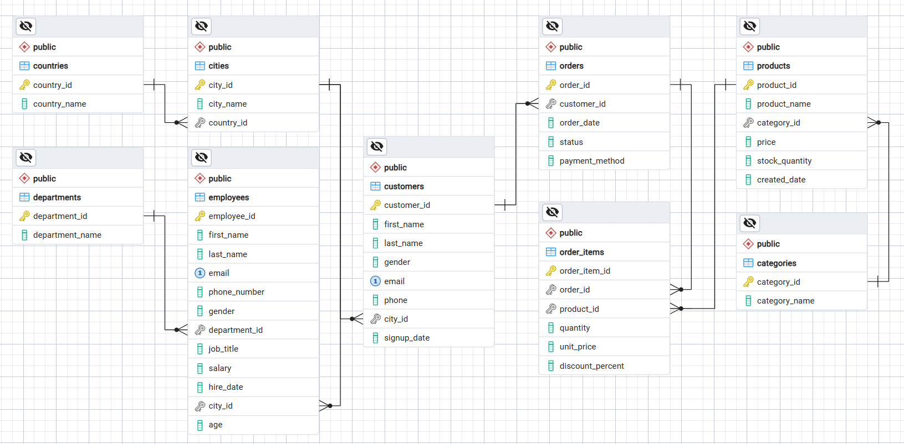

# 00 — Database Design

# Dataset Overview

The dataset represents a fictional technology and e-commerce company called **TechNova**.

The dataset covers business activity from:

**2018–2026**

It contains information about:

- Countries
- Cities
- Employees
- Departments
- Customers
- Products
- Categories
- Orders
- Order Items

Approximate dataset size:

| Table | Rows |
|---|---:|
| countries | 4 |
| cities | 14 |
| departments | 8 |
| employees | 110 |
| categories | 8 |
| products | 100 |
| customers | 5,000 |
| orders | 100,000 |
| order_items | 300,000+ |

The exact number of rows depends on the generator configuration.

---

# Database Structure

The database consists of 9 related tables designed to represent TechNova's business operations.



The main e-commerce relationship follows this flow:

    countries
        ↓
    cities
        ↓
    customers
        ↓
    orders
        ↓
    order_items
        ↓
    products
        ↓
    categories

There is also an employee structure:

    departments
        ↓
    employees
        ↓
    cities

The ERD shows how the tables are connected through Primary Keys and Foreign Keys.

This relational structure will be used throughout the SQL Intermediate lessons, especially for learning JOIN and multi-table business analysis.

---

# Tables

## 1. countries

Stores the countries where TechNova operates.

Columns:

- country_id
- country_name

Primary Key:

- country_id

---

## 2. cities

Stores cities and their corresponding countries.

Columns:

- city_id
- city_name
- country_id

Primary Key:

- city_id

Foreign Key:

- country_id → countries.country_id

---

## 3. departments

Stores company departments.

Columns:

- department_id
- department_name

Primary Key:

- department_id

---

## 4. employees

Stores employee information.

Columns:

- employee_id
- first_name
- last_name
- email
- phone_number
- gender
- department_id
- job_title
- salary
- hire_date
- city_id
- age

Primary Key:

- employee_id

Foreign Keys:

- department_id → departments.department_id
- city_id → cities.city_id

---

## 5. categories

Stores product categories.

Columns:

- category_id
- category_name

Primary Key:

- category_id

---

## 6. products

Stores product information.

Columns:

- product_id
- product_name
- category_id
- price
- stock_quantity
- created_date

Primary Key:

- product_id

Foreign Key:

- category_id → categories.category_id

---

## 7. customers

Stores customer information.

Columns:

- customer_id
- first_name
- last_name
- gender
- email
- phone
- city_id
- signup_date

Primary Key:

- customer_id

Foreign Key:

- city_id → cities.city_id

---

## 8. orders

Stores customer order information.

Columns:

- order_id
- customer_id
- order_date
- status
- payment_method

Primary Key:

- order_id

Foreign Key:

- customer_id → customers.customer_id

---

## 9. order_items

Stores the products contained in each order.

Columns:

- order_item_id
- order_id
- product_id
- quantity
- unit_price
- discount_percent

Primary Key:

- order_item_id

Foreign Keys:

- order_id → orders.order_id
- product_id → products.product_id

---

# Primary Key and Foreign Key

The database uses Primary Keys and Foreign Keys to connect tables.

### Primary Key

A Primary Key uniquely identifies each row in a table.

For example:

    customers
    customer_id

Each customer should have a unique `customer_id`.

### Foreign Key

A Foreign Key references a Primary Key from another table.

For example:

    customers.city_id
            ↓
    cities.city_id

This tells us which city belongs to each customer.

The main relationships are:

| Table | Foreign Key | References |
|---|---|---|
| cities | country_id | countries |
| employees | department_id | departments |
| employees | city_id | cities |
| products | category_id | categories |
| customers | city_id | cities |
| orders | customer_id | customers |
| order_items | order_id | orders |
| order_items | product_id | products |

---

# Business Rules

The generated dataset follows several business rules to make the data more realistic.

### Customer Signup

A customer cannot place an order before signing up.

    signup_date <= order_date

### Product Availability

A product cannot be purchased before it is created.

    created_date <= order_date

### Historical Orders

Older orders should not remain in active statuses such as:

- Processing
- Shipped

### Business Growth

The business grows over time.

2018–2019 represents the early startup period with lower transaction volume.

Later years gradually increase in transaction volume, with 2026 representing the mature/high-volume period.

### Promotional Dates

Certain dates generate higher transaction activity.

Examples include:

- Twin dates such as 10.10 and 11.11
- Payday periods
- Year-end sales

Twin dates receive:

**10% discount**

December 25–31 receive:

**15% discount**

### Customer Locations

Indonesian customers represent the majority of the dataset.

International customers are also included from:

- Singapore
- Malaysia
- Philippines

---

# Dataset Generation

The dataset is generated using:

    generate_technova_intermediate.py

The generator uses:

- `technova_employees.csv`
- `name_pool.csv`

and produces the final CSV dataset.

The workflow is:

    Source Files
        ↓
    Python Generator
        ↓
    CSV Dataset
        ↓
    PostgreSQL
        ↓
    SQL Intermediate Lessons

The Python generator is kept inside this lesson so that the dataset generation process can be tracked and reproduced.

---

# Generated Dataset

The generated files are stored inside:

    technova_enterprise_dataset/

Files:

    categories.csv
    cities.csv
    countries.csv
    customers.csv
    departments.csv
    employees.csv
    order_items.csv
    orders.csv
    products.csv

---

# Project Structure

The structure of Lesson 00 is:

    00_database_design/
      ├── README.md
      ├── schema.sql
      ├── generate_technova_intermediate.py
      ├── name_pool.csv
      ├── technova_employees.csv
      │
      ├── images/
      │   └── database-schema.png
      │
      └── technova_enterprise_dataset/
          ├── categories.csv
          ├── cities.csv
          ├── countries.csv
          ├── customers.csv
          ├── departments.csv
          ├── employees.csv
          ├── order_items.csv
          ├── orders.csv
          └── products.csv

---

# PostgreSQL Database

The dataset is imported into PostgreSQL.

The table structure is defined in:

    schema.sql

The schema creates the nine tables and their relationships using Primary Keys and Foreign Keys.

The database contains:

- countries
- cities
- departments
- employees
- categories
- products
- customers
- orders
- order_items

---

# Running the Generator

Requirements:

- Python 3.8+
- tqdm

Install `tqdm`:

```
pip install tqdm
```

Run the generator:

```
python generate_technova_intermediate.py
```

After the generator finishes, the CSV files will be available inside:

    technova_enterprise_dataset/

---

# Importing the Dataset

The recommended import order follows the table relationships.

### Step 1 — Create the Tables

Open PostgreSQL / pgAdmin 4 and run:

    schema.sql

### Step 2 — Import the CSV Files

Import the files in this order:

    1. countries.csv
    2. cities.csv
    3. departments.csv
    4. categories.csv
    5. employees.csv
    6. products.csv
    7. customers.csv
    8. orders.csv
    9. order_items.csv

This order ensures that referenced records already exist when Foreign Keys are inserted.

---

# Basic Validation

After importing the dataset, check the number of records in each table.

```
SELECT 'countries' AS table_name, COUNT(*) AS row_count FROM countries
UNION ALL
SELECT 'cities', COUNT(*) FROM cities
UNION ALL
SELECT 'departments', COUNT(*) FROM departments
UNION ALL
SELECT 'employees', COUNT(*) FROM employees
UNION ALL
SELECT 'categories', COUNT(*) FROM categories
UNION ALL
SELECT 'products', COUNT(*) FROM products
UNION ALL
SELECT 'customers', COUNT(*) FROM customers
UNION ALL
SELECT 'orders', COUNT(*) FROM orders
UNION ALL
SELECT 'order_items', COUNT(*) FROM order_items
ORDER BY table_name;
```

The results should match the generated dataset.

---

# What We Learned

The main purpose of this lesson is not to master database design.

The important concepts are:

- Tables represent different business entities
- Primary Keys identify records
- Foreign Keys connect tables
- Related tables allow multi-table analysis
- Business rules make synthetic data more realistic

This database will become the foundation for the upcoming SQL Intermediate lessons.

---

# Definition of Done

Lesson 00 is complete when:

- [x] Database structure has been designed
- [x] Python generator has been finalized
- [x] Source files are available
- [x] Dataset has been generated
- [x] PostgreSQL tables have been created
- [x] CSV files have been imported
- [x] Primary Key relationships are valid
- [x] Foreign Key relationships are valid
- [x] Dataset is ready for SQL Intermediate

---

# Key Takeaway

The SQL Beginner repository taught how to query data.

The SQL Intermediate repository introduces a more realistic relational structure.

Instead of working with one main table, we now have connected business entities:

    Customers
        ↓
    Orders
        ↓
    Order Items
        ↓
    Products
        ↓
    Categories

This structure gives us the foundation to learn how to combine information from multiple tables and eventually turn it into business insights.

**Database Design is complete.**

Next:

**Lesson 01 — CASE**